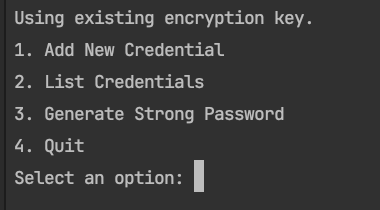
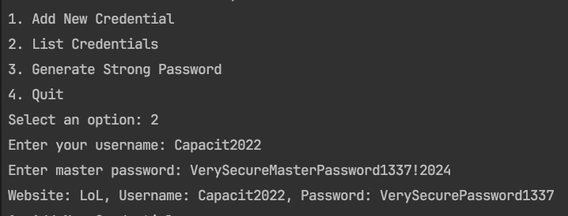
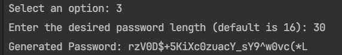

# SecurePassManager - Mini Project

## Introduction

SecurePassManager is a .NET-based console application designed to securely store and manage user credentials. With a focus on security and usability, it offers an easy way for users to keep track of their passwords for various services, ensuring that each is stored securely and accessible only through proper authentication.
## Setup
To run SecurePassManager:

- Ensure you have .NET Runtime installed on your system.
- Clone the repository to your local machine.
- Navigate to the project directory in your terminal or command prompt.
- Execute dotnet build to build the project.
- Run the application using dotnet run.

## Using SecurePassManager
Once the application is running:

- Add New Credential: Select option 1 and follow the prompts to enter the website, username, and password for the new credential.
- List Credentials: Select option 2 to view all stored credentials. Note that passwords are displayed in decrypted form for readability.
- Generate Strong Password: Select option 3 to generate a random, strong password. You can specify the length or use the default length.
- Quit: Select option 4 to exit the application.

## Security Model
### Data Protection
SecurePassManager protects user data using the following cryptographic techniques:

- AES-256 GCM Encryption: For secure storage of credentials, employing a strong symmetric-key cipher with built-in authentication for integrity checking.
- SHA-512 Hashing: Utilized for creating secure digests, primarily for validating the integrity of the master password.
- HMAC-SHA256: Ensures the authenticity and integrity of data before decryption, protecting against tampering.

### Key management
Encryption keys are securely generated using .NET's RandomNumberGenerator class and are stored outside the database in a file (key.txt). 
This file is generated upon the first run and reused thereafter. 
The keys are never hard-coded or exposed to end-users.

### Strong Password Generation
The application provides a mechanism to generate strong, random passwords using a mix of uppercase and lowercase letters, numbers, and special characters, enhancing security against brute-force attacks.

### Threat Protection
SecurePassManager is designed to protect against:

- **Unauthorized Access**: By encrypting credentials with AES-256 GCM, only users with the correct encryption key can access the stored information.
- **Data Breaches**: Encrypted storage means that even if the database is compromised, the credentials remain protected.
- **Password Reuse**: The strong password generator encourages the use of unique passwords for each service.

### limitations and Pitfalls
- **Key Storage**: The encryption key is stored locally. If this key is lost or compromised, the encrypted data cannot be recovered.
. **Single Device Usage**: Currently, there is no built-in mechanism for syncing data across devices.
- **Master Password**: There is no master password to access the application, so physical access to the running application could bypass security measures.

### Cryptography in Use

1. **Cryptographic Random Number Generator (CRNG)**:
   - The .NET `RandomNumberGenerator` class will be used to generate secure random numbers.

2. **Shared-key (Symmetric) Cipher**:
   - The choice of encryption is AES-256, specifically in GCM mode for its added authentication capabilities. .NET's `AesGcm` class can be used for this purpose. Each password is encrypted before storage, using a unique IV generated for each session to enhance security.

3. **Hashing**:
   - While not directly storing passwords, SHA512 hashing will be applied, provided by .NET's `SHA512` class, for creating secure digests when needed, such as for verifying the integrity of data.

4. **Message Authentication Code (MAC)**:
   - HMAC using SHA256 for verifying the authenticity and integrity of stored data. .NET's `HMACSHA256` class is utilized for this purpose, ensuring that the data has not been tampered with.

## Screenshots of the Application
- **Start**

- **case 1**

- **case 3**

